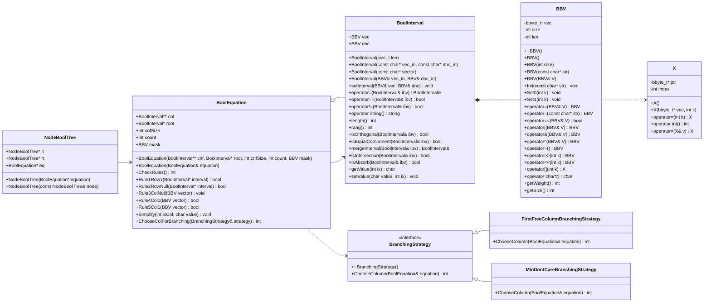

# Лабораторная работа по предмету: "Разработка средств защиты информации"
## Тема: "Интеграция механизма аллокации памяти с фиксированными блоками на C++, в реализуемое приложение"
> 4 курс 2 семестр \
> Студент группы 932224 - **Ликонцев Николай**

---

## 1. Постановка задачи

> Рассмотреть пользовательский проект. В пользовательском проекте обеспечить работу с памятью через `Allocator`. Обеспечить архитектурную возможность изменения правила выбора переменной ветвления (использовать паттерн «Стратегия») для SAT-задачи.

> Исследовать пользовательский проект на уязвимости с помощью любого доступного статического анализатора, а также с помощью Valgrind динамического анализа. По результатам исследования подготовить отчёт.

---

## 2. Предлагаемое решение

### Зависимости проекта

| Компонент | Версия / источник |
|-----------|------------------|
| **CMake** | ≥ 3.10 |
| **Стандарт C++** | 14 |
| **Allocator** | [endurodave/Allocator](https://github.com/endurodave/Allocator) |

---

## UML-диаграмма классов



---

### Архитектура решения

Основные компоненты:

- **main.cpp** - точка входа приложения. Считывает исходные данные SAT-задачи из `.pla`-файла, строит КНФ, создаёт `BoolEquation` и запускает DPLL-поиск.
- **X** - прокси-класс для доступа к одному биту вектора `BBV`; возвращается `operator[]` и позволяет читать и записывать отдельный бит через перегрузку присваивания и приведения к `int`.
- **BBV** - битовый вектор, используемый для хранения булевых значений, масок и представления интервалов.
- **BoolInterval** - класс интервала булевой функции; хранит вектор значений (`vec`) и don't-care маску (`dnc`), поддерживает операции сравнения, объединения, проверки поглощения и пересечения.
- **BoolEquation** - модель SAT-задачи. Хранит КНФ в виде массива `BoolInterval*`, корневой интервал, маску закреплённых столбцов и реализует правила упрощения DPLL.
- **BranchingStrategy** - интерфейс стратегии выбора переменной ветвления (паттерн «Стратегия»):
  - **FirstFreeColumnBranchingStrategy** - выбирает первый свободный (незакреплённый) столбец.
  - **MinDontCareBranchingStrategy** - выбирает столбец с минимальным числом символов `-` (don't-care).
- **NodeBoolTree** - узел дерева поиска; связывает текущее состояние уравнения с левым (`lt`) и правым (`rt`) поддеревьями.

Таким образом, проект разделён на три слоя: представление данных (`BBV`, `BoolInterval`), логика SAT-решателя (`BoolEquation`, `NodeBoolTree`) и стратегия выбора ветвления (`BranchingStrategy` и её реализации).

---

### Пользовательский аллокатор (Allocator)

#### Что это

[endurodave/Allocator](https://github.com/endurodave/Allocator) - библиотека из одного класса `Allocator`, реализующего пул блоков **фиксированного размера** на базе free-list. Операции `Allocate`/`Deallocate` работают за O(1), внутри пула не возникает фрагментации, а источник памяти задаётся явно при создании пула.

#### Способы использования

**1. Через макросы**

В заголовке класса ставится `DECLARE_ALLOCATOR`, в `.cpp` - `IMPLEMENT_ALLOCATOR`:

```cpp
// header
class Foo {
    DECLARE_ALLOCATOR
};

// source
IMPLEMENT_ALLOCATOR(Foo, /*objects=*/0, /*memory=*/0)
```

Где `objects` - число объектов в пуле (`0` - без верхней границы, блоки берутся из кучи по требованию), а `memory` - источник памяти (`0`/`NULL` - куча; указатель - внешний статический буфер). После подключения любой `new Foo`/`delete Foo` идёт через указанный пул. Именно так подключен аллокатор во всех классах решателя: `BBV`, `X`, `BoolInterval`, `BoolEquation`, `NodeBoolTree`, `MinDontCareBranchingStrategy`, `FirstFreeColumnBranchingStrategy`.

**2. Прямое использование инстанса**

Создаётся явный объект `Allocator` и вызываются `Allocate`/`Deallocate` вручную:

```cpp
Allocator pool(sizeof(T), N, /*memory=*/nullptr, "T-pool");
void* mem = pool.Allocate(sizeof(T));
T* obj    = new (mem) T(...);
obj->~T();
pool.Deallocate(obj);
```

Либо через шаблон-обёртку со встроенным статическим буфером:

```cpp
AllocatorPool<T, N> pool;   // внутри держит CHAR m_memory[sizeof(T) * N]
```

#### Режимы работы

Режим выбирается комбинацией параметров конструктора `Allocator(size, objects, memory)`:

| Режим | Параметры | Источник памяти | Поведение |
|-------|-----------|-----------------|-----------|
| `HEAP_BLOCKS` | `objects=0`, `memory=NULL` | Куча | Каждый новый блок берётся из кучи; освобождённые блоки попадают в free-list и переиспользуются |
| `HEAP_POOL` | `objects=N>0`, `memory=NULL` | Куча | Сразу резервируется `N × blockSize` байт; дальнейшие выделения без обращений к heap |
| `STATIC_POOL` | `objects=N>0`, `memory=&buf` | Внешний буфер | Никаких обращений к куче; пользователь сам владеет памятью |

---

## 3. Инструкция для пользователя

Перед первой сборкой необходимо склонировать внешний репозиторий Allocator в корень проекта:

```bash
git clone https://github.com/endurodave/Allocator.git
```

### Сборка

<details>
<summary>Linux / macOS</summary>

```bash
mkdir -p build && cd build
cmake ..
cmake --build .
```

</details>

<details>
<summary>Windows</summary>

```powershell
mkdir build
cd build
cmake ..
cmake --build .
```

</details>

### Запуск

```bash
./SAT_Solver <input_file> [--strategy=STRATEGY | -s STRATEGY]
./SAT_Solver --bench
```

**Стратегии ветвления:**

| Имя | Описание |
|-----|----------|
| `min-dont-care` | Выбирает столбец с минимальным числом `-` *(по умолчанию)* |
| `first-free` | Выбирает первый свободный столбец |

**Примеры:**

```bash
# Решить задачу со стратегией по умолчанию
./SAT_Solver ../SatExamples/sat_ex_1.pla

# Указать стратегию явно
./SAT_Solver ../SatExamples/Sat_ex30_3.pla --strategy=first-free
./SAT_Solver ../SatExamples/Sat_ex30_3.pla -s min-dont-care

# Запустить бенчмарки аллокатора
./SAT_Solver --bench
```

Программа выводит `SAT` и найденное присваивание либо `UNSAT`.

---

## 4. Юнит-тесты

В проекте реализованы два набора тестов в каталоге `tests/`.

### Сборка с тестами

```bash
cmake .. -DBUILD_TESTS=ON
cmake --build .
```

### Запуск

```bash
# Запустить через ctest
ctest --output-on-failure

# Или напрямую
./test_strategies
./test_benchmarks
```

### test_strategies

Проверяет корректность и производительность обеих стратегий ветвления.

| Тест | Что проверяет |
|------|--------------|
| `test_firstfree_returns_column_zero_when_none_masked` | Возвращает столбец 0, если маска пуста |
| `test_firstfree_skips_masked_prefix` | Пропускает закреплённые столбцы |
| `test_firstfree_returns_minus_one_when_all_masked` | Возвращает `-1`, если все столбцы закреплены |
| `test_mindontcare_picks_column_with_fewest_dashes` | Выбирает столбец с минимальным числом `-` |
| `test_mindontcare_avoids_column_full_of_dashes` | Не выбирает столбец, полностью состоящий из `-` |
| `test_mindontcare_tie_goes_to_first_index` | При равенстве счётчиков выбирает первый столбец |
| `test_mindontcare_returns_minus_one_when_all_masked` | Возвращает `-1`, если все столбцы закреплены |
| `test_strategy_performance` | Прогоняет обе стратегии на всех 70 `.pla`-файлах, проверяет совпадение ответов SAT/UNSAT и выводит таблицу времени |

### test_benchmarks

Проверяет инфраструктуру аллокатора и функции измерения времени.

| Тест | Что проверяет |
|------|--------------|
| `test_measure_microseconds_returns_nonneg` | `MeasureMicroseconds` возвращает ≥ 0 и > 0 для реальной нагрузки |
| `test_allocator_heap_blocks_stats` | Статистика аллокатора в режиме `HEAP_BLOCKS` (allocations, deallocations, blocksInUse) |
| `test_allocator_heap_pool_stats` | Статистика в режиме `HEAP_POOL`; проверяет переиспользование блоков после полного освобождения |
| `test_allocator_static_pool_stats` | Статистика в режиме `STATIC_POOL` |
| `test_benchmark_mode_heap_returns_positive_time` | `BenchmarkAllocatorMode` с heap-аллокатором возвращает > 0 мкс |
| `test_benchmark_mode_heap_pool_returns_positive_time` | То же для `HEAP_POOL` |
| `test_benchmark_mode_static_pool_returns_positive_time` | То же для `STATIC_POOL` |
| `test_pool_speed_comparison` | Сравнивает время heap / heap-pool / static-pool на 100 000 аллокациях; пул не должен быть медленнее heap более чем в 10 раз |
| `test_bad_alloc_benchmark_does_not_crash` | `RunAllocatorBadAllocBenchmarks` завершается без краша |

---

## 5. Бенчмарки аллокатора

При запуске с флагом `--bench` вызывается `RunAllocatorBenchmarks()`: на одинаковой нагрузке сравниваются четыре варианта - штатный `new[]`/`delete[]`, `HEAP_BLOCKS`, `HEAP_POOL` и `STATIC_POOL` - а затем запускается exhaustion-сценарий, который удерживает память до возникновения `bad_alloc`. Для каждого режима выводится время выделения, освобождения и суммарное время.

```bash
./SAT_Solver --bench
```

---

## 6. Анализ и отчёты

### Статический анализ - PVS-Studio

Анализ выполнен командой:

```bash
pvs-studio-analyzer analyze -o pvs_report.log -j4
plog-converter -a GA:1,2 -t json -o reports/pvs_studio/pvs_report pvs_report.log
```

**Итоговая статистика:**

| Источник | Предупреждений |
|---------|---------------|
| Исходники проекта | 522 |
| Библиотека Allocator | 83 |
| **Всего** | **605** |

| Уровень | Кол-во |
|---------|--------|
| Уровень 1 (высокий) | 413 |
| Уровень 2 (средний) | 153 |
| Уровень 3 (низкий) | 39 |

**Ключевые находки в исходниках проекта:**

| Код | Уровень | Кол-во | Описание | Файл |
|-----|---------|--------|----------|------|
| V755 | 2 | 1 | Возможное переполнение буфера при копировании данных из `std::cin` | `BBV.cpp:437` |
| V690 | 2 | 4 | Класс реализует `operator=`, но не имеет конструктора копирования (нарушение правила трёх) | `X`, `BoolInterval`, `BoolEquation`, `NodeBoolTree` |
| V1077 | 2 | 15 | Условная инициализация в конструкторе `X` может оставить поля `ptr`, `index` неинициализированными | `BBV.cpp` |
| V668 | 2 | 8 | Бессмысленная проверка указателя на `NULL` после `new` - исключение возникнет раньше | `BBV.cpp` |
| V2565 | 2 | 2 | Косвенная рекурсия в `solveDPLL` (строки 35 и 58) | `main.cpp` |
| V108 | 2 | 67 | Индекс массива `cnf[]` имеет тип `int`, а не `size_t` | `boolequation.cpp` |
| V302 | 2 | 1 | `BBV::operator[]` принимает `int` вместо `size_t` | `BBV.h:47` |
| V688 | 3 | 2 | Аргумент функции `size` совпадает по имени с полем класса | `BBV.h:54`, `boolequation.cpp:11` |
| V818 | 2 | 5 | Инициализация поля через `operator=` в теле конструктора; эффективнее использовать список инициализации | `boolequation.cpp`, `boolinterval.cpp` |

**Стилевые и MISRA-предупреждения (низкий приоритет):**

| Код | Кол-во | Описание |
|-----|--------|----------|
| V2507 / V3504 | 130 | Тело `if`/`else` не заключено в фигурные скобки |
| V2506 | 70 | Функция имеет несколько точек выхода (`return`) |
| V2563 / V3539 | 72 | Арифметика указателей вместо индексирования массива |
| V2575 / V3549 | 60 | Объявления в глобальном пространстве имён |
| V2511 | 26 | Использование `new` (MISRA C++: предпочтительны умные указатели) |
| V2513 / V3508 | 5 | Использование `strlen` |

**Значимые выводы:**

- Единственная потенциальная уязвимость безопасности - **V755** (`BBV.cpp:437`): чтение строки из `std::cin` в буфер фиксированного размера без проверки длины. Исправляется заменой на `std::string` или ограничением ввода.
- Нарушение правила трёх (**V690**) в классах `X`, `BoolInterval`, `BoolEquation` и `NodeBoolTree`: отсутствие конструктора копирования при наличии `operator=` и деструктора с ручным управлением памятью может привести к двойному освобождению памяти при копировании объектов.
- Остальные предупреждения относятся к стилю кода (MISRA C++) и не влияют на корректность работы программы при текущих условиях использования.

Полный отчёт: `reports/pvs_studio/pvs_report`

---

### Динамический анализ - Valgrind Memcheck

Анализ выполнен на примере `Sat_ex30_3.pla` (30 переменных, 40 клозов):

```bash
valgrind --tool=memcheck --leak-check=full --show-leak-kinds=all \
         --track-origins=yes ./SAT_Solver ../SatExamples/Sat_ex30_3.pla
```

**Результаты:**

| Категория | Кол-во записей | Утечка (байт) |
|-----------|---------------|--------------|
| Definitely Lost | 69 | ~867 000 |
| Indirectly Lost | 16 | ~18 000 |
| **Итого** | **85** | **884 986** |

Ошибок обращения к неинициализированной памяти и выхода за границы массива **не обнаружено**.

**Причина утечек:** класс `BoolEquation` выделяет массив `BoolInterval** cnf` в конструкторе, но не имеет деструктора - массив никогда не освобождается. Каждый шаг ветвления DPLL создаёт копию `BoolEquation` через копирующий конструктор, который выделяет второй массив `cnf` - тоже без освобождения. Буферы `BBV` внутри интервалов теряются косвенно через эти указатели.

**Исправление:** добавить деструктор в `BoolEquation`:

```cpp
BoolEquation::~BoolEquation() {
    delete[] cnf;
}
```

Полный HTML-отчёт: `build/valgrind_report.html`
